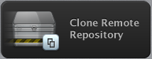
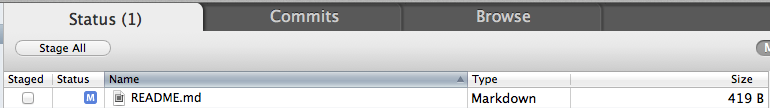
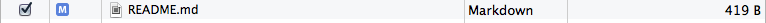
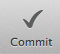
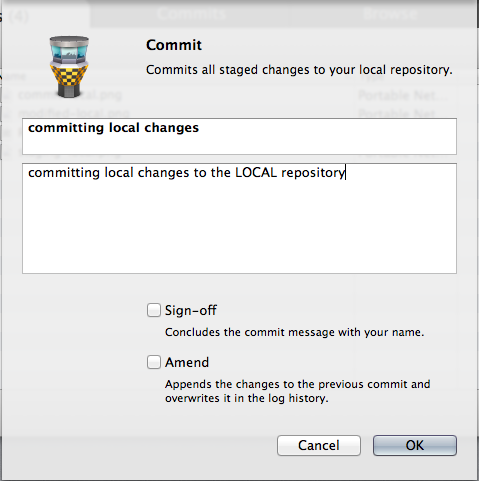
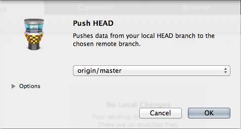
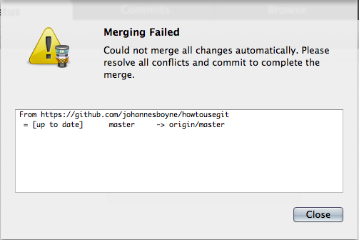

howtousegit
===========

## CLI

* clone git repo: `$ git clone https://github.com/johannesboyne/howtousegit.git`
* *modify README.md*
* add modified: `$ git add README.md`
* commit: `$ git commit -m "README modified"`
* push: `$ git push`
* *remote repo has been updated*
* pull: `$ git pull`
* *merge conflict*
* `Auto-merging README.md
CONFLICT (content): Merge conflict in README.md
Automatic merge failed; fix conflicts and then commit the result.`
* `$ git mergetool -t opendiff` (or `git mergetool`)
* ---
* new branch: `$ git branch hotfix`
* checkout new branch: `$ git checkout hotfix` or, shortform (creating and checkout): `$ git checkout -b hotfix`
* git 

## Git Tower

* clone git repo: 
* *modify README.md* 
* add modified: 
* commit:   
* push:  
* *remote repo has been updated*
* pull: 
* *merge conflict*
* 
* 
