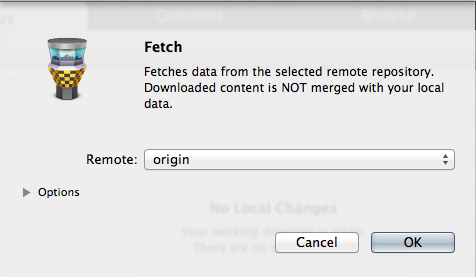
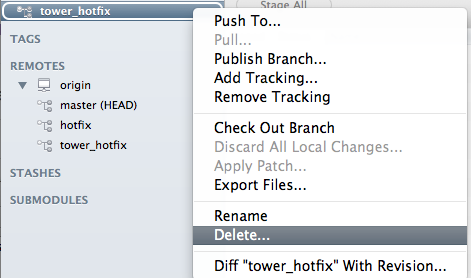

howtousegit
===========

*The slides for this repo will be uploaded soon...*

## CLI

* clone git repo: `$ git clone https://github.com/johannesboyne/howtousegit.git`
* *modify README.md*
* add modified: `$ git add README.md`
* commit: `$ git commit -m "README modified"`
* push: `$ git push`
* *remote repo has been updated*
* pull: `$ git pull`
* *merge conflict*
* `Auto-merging README.md
CONFLICT (content): Merge conflict in README.md
Automatic merge failed; fix conflicts and then commit the result.`
* `$ git mergetool -t opendiff` (or `git mergetool`)
* ---
* new branch: `$ git branch hotfix`
* checkout new branch: `$ git checkout hotfix` or, shortform (creating and checkout): `$ git checkout -b hotfix`
* get status: `$ git status`
* add modified, commit: `$ git add README.md && git commit -m "changed README"`
* push local branch to remote repo: `$ git push -u origin hotfix`
* ---
* fetch remote branches: `$ git fetch`
* show all branches: `$ git branch -r`
* merge branches: `$ git merge origin/tower_hotfix` or if you pulled `$ git merge tower_hotfix`
* `$ git checkout master` `$ git merge hotfix` `$ git branch -d hotfix`
* deleting remote branch: `$ git push origin :hotfix`

## Git Tower

* clone git repo: 
* *modify README.md* 
* add modified: 
* commit:   
* push:  
* *remote repo has been updated*
* pull: 
* *merge conflict*
* 
* 
* ---
* new branch:  
* push local branch to remote repo: 
* ---
* fetch remote branches: 
* merge branches:  
* deleting branch: 
